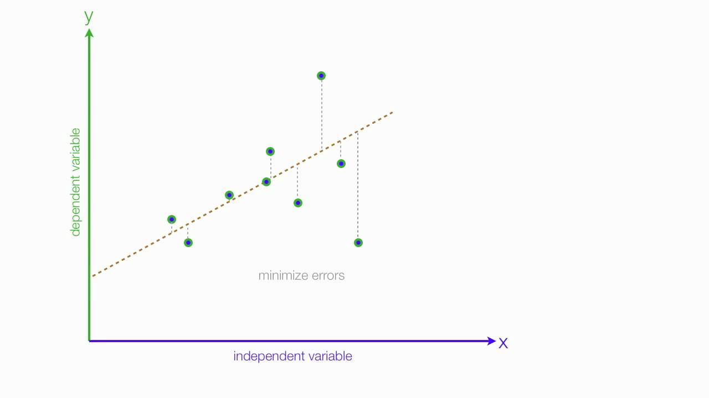

# Arbetsflöde för AI-projekt

## Datainsamling

När vi vill göra ett AI-projekt är det viktigt att komma ihåg den gamla devisen: "skit in - skit ut". Om datamängden vi använder inte är korrekt, relevant och pålitlig kan vi inte lita på att vår modell blir det heller. Data går att hitta på många ställen och i många format, några exempel på ställen att leta är kaggle, SCB eller Eurostat. Där vill vi hitta tabeller, ofta i .csv eller i .JSON som innehåller de metadata vi är intresserade av, i det här fallet:
- pris
- antal rum
- geografiskt läge (kvantifierbart, exempelvis antal km från stadskärna)
- storlek
- och så vidare

Det kan vara en bra idé att analysera datan och titta på saker som median, 10e och 90e percentilen och annat för att få en bild av datans relevans innan man kör igång.

Beroende på vilket format filen är i och vilka metadata som finns kan vi behöva göra lite "data-cleaning" innan vi kan sätta igång. Vi vill se till att vi bara läser in den data vi behöver och inget mer. Vi kan också behöva gör en filkonvertering så att vi kan läsa in datan smidigt, exempelvis till en .csv.

Det kan också vara en idé att göra några enkla diagram där du analyserar sambandet mellan pris och dina olika variabler för att se att det ser rimligt ut. (Storlek på hus borde exempelvis vara positivt korrelerat med pris)

## Skapa modell

När du är säker på att datan går att använda bör du börja fundera vilken typ av modell du vill använda. Det finns många algoritmer att välja på: k-nearest neighboors, Naive Bayes och Deep learning. Mer avancerad betyder inte nödvändigtvis bättre, så du bör därför fundera över vilken modell som passar bäst just i detta läge. I det här fallet väljer vi en enkel linjär regression vilket försöker skapa en linje där det kvadrerade avståndet mellan datapunkterna och linjen ska vara så litet som möjligt. 

Denna modell kan hjälpa oss att se trender mellan våra features (storlek, antal rum, läge) och slutpriset. Den kan också hjälpa oss att se hur stor del av prisförändringen som förklaras av en viss feature. Exempelvis kanske storleken förklarar 20% av variationen i pris medan läget förklarar 30% av variationen i pris. Detta lär oss att läge är viktigare än storlek för priset.

## Linjär regression

En linjär regression försöker anpassa en rät linje till en mängd datapunkter där det summerade kvadrerade  avståndet ( i y-led) mellan datapunkterna och linjen ska vara så litet som möjligt. 

<figcaption align = "left"><b>Fig. 1 - Linjär regression med en oberoende variabel</b></figcaption>
 

Matematiskt ser det ut såhär: $Y = \beta + \beta_1X_1 + ... + \beta_mX_m+ \epsilon$. Där $Y$ är priset, $X_i$ är våra olika features, $\beta$ är startvärdet, $\beta_i$ är de olika "vikterna" för våra features och $\epsilon$ är felmarginalen.

Vi bör dock vara vaksamma på att ett linjärt samband kanske inte är den bästa modellen för vårt valda exempel. Företeelser som kan låta sig modellera bra linjärt inom vissa intervall kan avvika kraftigt utanför dessa intervall.

---

## Källor

- Multipel linjär regresssion. [Wikipedia](https://sv.wikipedia.org/wiki/Multipel_linj%C3%A4r_regression) hämtad 2022-09-01 14:16
- House price index. [Eurostat](https://ec.europa.eu/eurostat/databrowser/view/prc_hpi_inw/default/table?lang=en) Hämtad 2022-09-01 14:20
- Zillow house price Data. [kaggle](https://www.kaggle.com/datasets/paultimothymooney/zillow-house-price-data) Hämtad 2022-09-01 14:22
- Fastighetspriser och lagfarter. [SCB](https://www.scb.se/hitta-statistik/statistik-efter-amne/boende-byggande-och-bebyggelse/fastighetspriser-och-lagfarter/fastighetspriser-och-lagfarter/) Hämtad 2022-09-01 14:29